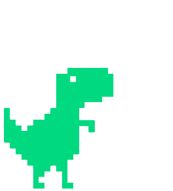
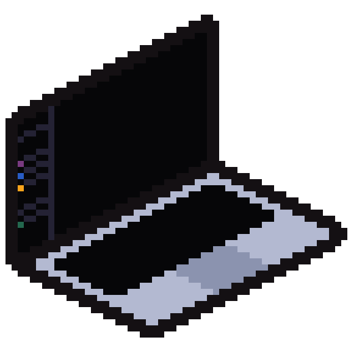
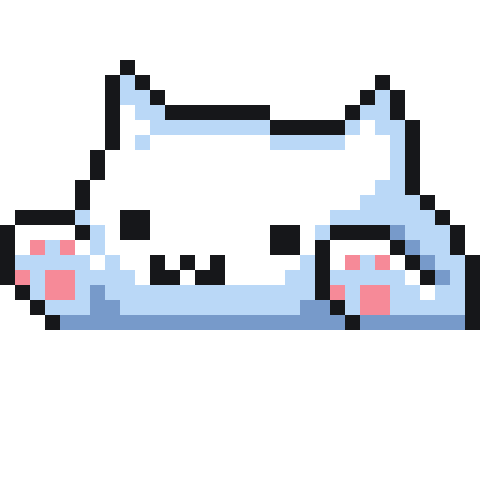
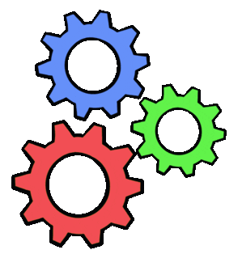
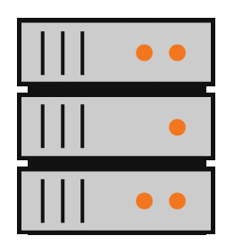
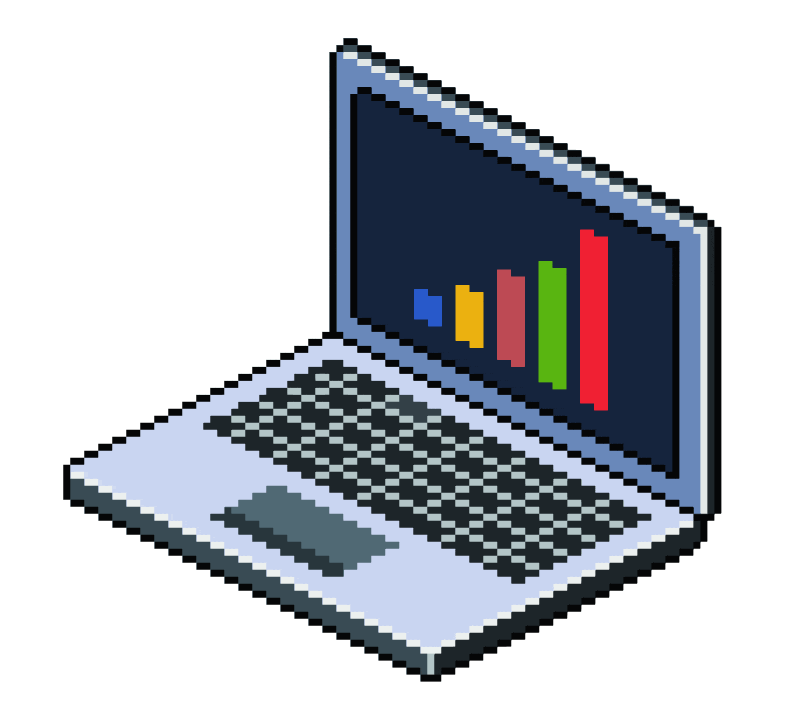
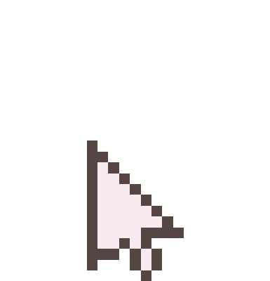

  

  <h3 align="center">
    
      
    
    , &lt;𝚌𝚘𝚍𝚎𝚛𝚜/&gt; !
    
      
    
  </h3>

  

    
  

  

    <b><samp>Click para conocer mas de mi </samp></b>
  

   

  <blockquote align="justify">
    

      Me fascina cómo la tecnología ha traído cambios a nuestras vidas que nunca pudieron haberse predicho; ser testigo de la expansión de las ciencias de la computación me llevó a considerar estudiar desarrollo de software desde temprana edad, y mi entusiasmo no ha dejado de crecer desde entonces. me encanta explorar nuevas tecnologías y usarlas para construir cosas geniales
    

    

      <b>Me encanta trabajar en equipo con diferentes personas</b>, porque cada integrante aporta experiencias y perspectivas que enriquecen el aprendizaje y fortalecen los resultados. <b>¡Juntos podemos crear un "Hello World" mejor!</b>
    

    

       
       
    

     
    

      Si buscas un desarrollador competente que se enorgullece de entregar resultados de calidad, no busques más.
    

  </blockquote>

 

  Soy un estudiante y <b>desarrollador web full stack</b> apasionado por el desarrollo de software y las tecnologías web. Me encanta crear soluciones digitales a medida que resuelvan problemas del mundo real. Con más de 2 años de experiencia como estudiante en Analisis y Desarrollo de Software, busco oportunidades de desarrollo y colaboraciones tecnológicas.

  <h3> | Mi racha de contribuciones</h3>
  

    
  

  <h3> | Perfil Ocupacional</h3>
  

    Me ocupo del análisis, diseño, implementación y mantenimiento de aplicaciones informáticas, siempre respondiendo a los requerimientos del servicio. Estoy capacitado en la recolección y análisis de requisitos, así como en el desarrollo de soluciones tecnológicas que mejoren la calidad de vida de las personas. Poseo capacidad de autoaprendizaje y actualización constante, lo que me permite mantenerme al día con las últimas tendencias y tecnologías. Utilizo metodologías ágiles en el trabajo en equipo y puedo proponer innovaciones y mejoras tecnológicas en los procesos de negocio.
  

  <h3> | Lo que hago</h3>
  

    Levantamiento de información para establecer requerimientos de software, análisis y diseño de la solución de software, modelamiento de la interfaz de usuario y de la base de datos. Implementación del código, pruebas funcionales, documentación a nivel de manuales técnicos y de usuario.
  

  <h3> | Habilidades</h3>

  

    <b> Lenguajes de Programación:</b>
     
    
    
    
    
      
    <b> Frontend:</b>
     
    
    
    
    
    
    
      
    <b> Backend:</b>
     
    
    
      
    <b> Bases de Datos:</b>
     
    
    
    
      
    <b> Herramientas:</b>
     
    
    
    
    
    
    
    
    
    
  

  <h3> | Actualmente estudiando</h3>
  <ul>
    <li>React Framework</li>
    <li>Typescript Lenguaje</li>
    <li>Next.js Framework</li>
  </ul>

  <h3> | Conoce más de lo que hago y contáctame:</h3>
  

    
    
  

  

